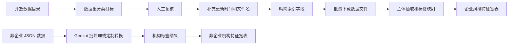

# Beijing Open Data Enterprise Risk Pipeline

基于北京市公共数据开放平台的企业风控数据筛选、下载、标签化与画像构建流水线。

项目从开放数据平台的大规模数据目录出发，筛选银行业务关心的涉企信息，自动补充数据集元信息，批量下载数据文件，并将原本以“数据集”为单位的公开数据整理为以“企业/机构”为中心的风险标签和特征宽表。

## 项目定位

本项目面向银行贷前风控、精准获客、合规信息补充和金融产品创新等场景，重点解决三个问题：

- 哪些公开数据集对银行有业务价值；
- 如何从结构不统一的 CSV/Excel 文件中识别企业或机构主体；
- 如何将处罚、资质、荣誉、补贴、检查等信息转化为可解释的标签和宽表特征。

## 核心能力

- **开放数据筛选**：从约 `4433` 个北京市开放数据目录中筛选涉企数据，并沉淀关键词分类规则。
- **数据集元信息补充**：自动访问详情页，补充更新时间和实际下载文件名。
- **批量下载与断点处理**：通过 Selenium 半自动下载数据文件，并记录失败清单。
- **主体抽取与标签映射**：自动识别企业名称列，对检查、抽检、执法类数据做行级过滤和标签生成。
- **风控宽表构建**：聚合企业命中标签，生成可用于后续建模或分析的特征矩阵。
- **非企业机构扩展**：支持事业单位、社会组织、医疗机构、学校等非企业主体的标签化处理。

## 处理流程



## 目录结构

```text
.
├── README.md
├── pyproject.toml
├── requirements.txt
├── .env.example
├── docs/
│   └── pipeline.md
├── scripts/
│   ├── enterprise_kyc_classifier.py
│   ├── dataset_freshness_and_filename_updater.py
│   ├── batch_downloader.py
│   ├── prune_columns.py
│   └── build_entity_profile_one_pass.py
├── agent/
│   ├── CodeGeneratePrompt.txt
│   ├── gemini_batchThreadPoolExecutor.py
│   ├── convert_table_to_json.py
│   ├── input_jsons/
│   └── output_results/
├── dataset/
└── output/
```

## 环境准备

建议使用 Python 3.10 及以上版本。

```bash
python -m venv .venv
source .venv/bin/activate
pip install -r requirements.txt
```

Windows PowerShell 可使用：

```powershell
python -m venv .venv
.\.venv\Scripts\Activate.ps1
pip install -r requirements.txt
```

Selenium 相关脚本还依赖本机 Chrome 浏览器和匹配版本的 ChromeDriver。

## 企业数据流程

### 1. 数据集分类

输入：`output/目录清单.xlsx`

```bash
python scripts/enterprise_kyc_classifier.py \
  --input-file output/目录清单.xlsx \
  --output-file output/目录清单_分类结果.xlsx
```

输出会新增：

- `一级分类 (Core Risk Level)`
- `业务标签 (Tags)`

分类后需要人工复核，形成：

```text
output/目录清单_分类结果_人工过筛.xlsx
```

### 2. 补充更新时间和具体文件名

```bash
python scripts/dataset_freshness_and_filename_updater.py \
  --input-file output/目录清单_分类结果_人工过筛.xlsx \
  --output-file output/目录清单_分类结果_人工过筛_更新时间_补充文件名.xlsx
```

### 3. 精简索引列

```bash
python scripts/prune_columns.py
```

默认输出：

```text
output/目录清单_分类结果_人工过筛_更新时间_补充文件名_精简列信息.xlsx
```

### 4. 批量下载数据文件

```bash
python scripts/batch_downloader.py \
  --input output/目录清单_分类结果_人工过筛_更新时间_补充文件名.xlsx \
  --download-dir output/bank
```

该步骤需要人工扫码登录北京市开放数据平台。

### 5. 构建企业风控宽表

```bash
python scripts/build_entity_profile_one_pass.py \
  --index-file output/目录清单_分类结果_人工过筛_更新时间_补充文件名_精简列信息.xlsx \
  --csv-dir output/bank \
  --output-file output/特征矩阵风控模型宽表.xlsx
```

同时会生成未匹配文件、手动处理文件等辅助结果，便于回溯和补充处理。

## 非企业机构流程

`agent/` 目录用于处理事业单位、社会组织、医院、学校、合作社等非企业机构数据。

### 1. 配置 API Key

可以参考 `.env.example` 记录本地配置，但脚本默认读取当前 shell 环境变量。运行前请导出自己的 Key：

```bash
export MODELVERSE_API_KEY=your_api_key_here
export MODELVERSE_BASE_URL=https://api.modelverse.cn/v1/
export MODELVERSE_MODEL=gemini-2.5-pro
```

Windows PowerShell：

```powershell
$env:MODELVERSE_API_KEY="your_api_key_here"
$env:MODELVERSE_BASE_URL="https://api.modelverse.cn/v1/"
$env:MODELVERSE_MODEL="gemini-2.5-pro"
```

不要将真实 API Key 写入代码或提交到仓库。

### 2. 批量处理 JSON 文件

```bash
python agent/gemini_batchThreadPoolExecutor.py \
  --input-folder agent/input_jsons \
  --output-folder agent/output_results \
  --max-workers 10
```

常用参数：

- `--model`：指定模型名称，默认读取 `MODELVERSE_MODEL` 或使用 `gemini-2.5-pro`。
- `--base-url`：指定兼容 OpenAI 协议的服务地址。
- `--overwrite`：覆盖已经存在的 `_result.json` 文件。
- `--api-key-env`：指定读取 API Key 的环境变量名。

输出格式示例：

```json
{
  "file_name": "example.json",
  "file_tags": ["示范基地"],
  "results": [
    {
      "entity_name": "某某机构",
      "credit_code": "9111...",
      "tag": "示范基地"
    }
  ],
  "filtered_out_count": 12
}
```

## 标签体系

企业数据当前覆盖的一级分类包括：

- 严重信用违约风险
- 经营合规预警
- 经济优质企业
- 科技与创新实力
- 政府表彰与荣誉
- 政策扶持与奖补

非企业机构标签体系覆盖社会组织、医疗机构、教育机构、农业基地、政府监管、荣誉资质等维度，完整标签可查看：

```text
agent/非企业数据标签列表.txt
```

## 数据与输出说明

- `dataset/`：原始开放数据或样例数据。
- `output/`：企业流程的阶段性产物和最终宽表。
- `agent/input_jsons/`：非企业流程的输入 JSON。
- `agent/output_results/`：非企业流程的模型处理结果。

由于 GitHub 文件大小限制，部分超大原始数据文件未完整入库。仓库中保留了核心代码、文档、样例数据和主要中间结果，便于复现实验链路和理解处理逻辑。

## 维护建议

- 新增标签规则时，优先补充分类依据和业务含义，避免只堆关键词。
- 对检查、抽检、执法类数据，优先保留行级过滤逻辑，减少整表误标。
- 新增外部 API 调用时，统一从环境变量读取密钥。
- 对无法自动识别主体列的数据，记录到手动处理清单，避免静默丢失。

更多脚本级输入输出关系见 [docs/pipeline.md](docs/pipeline.md)。
