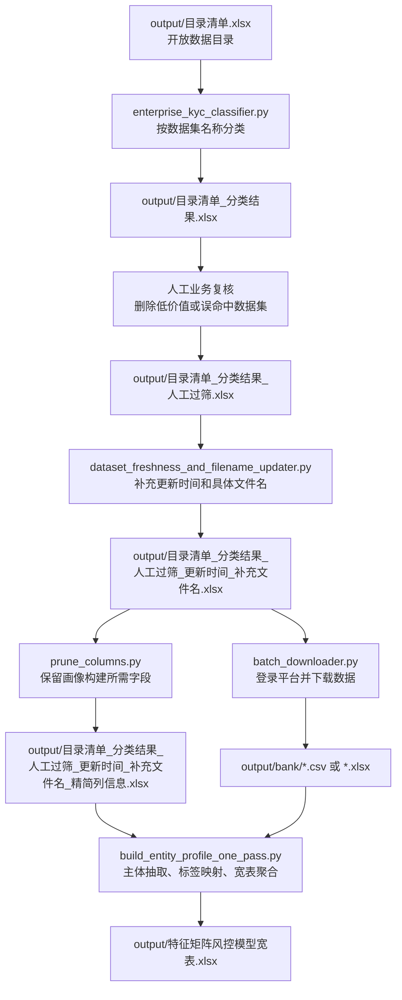
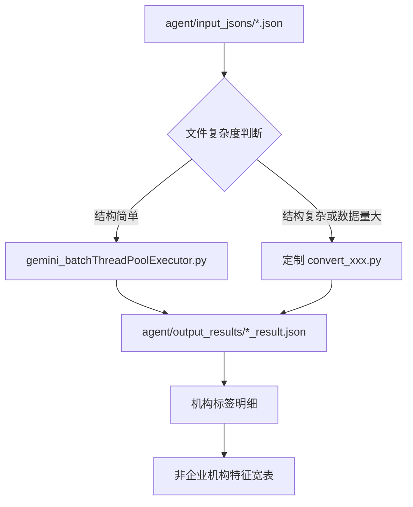

# 项目处理链路

本文档面向第一次接手项目的人，说明每个任务要做什么、输入是什么、输出是什么，以及应该按什么顺序运行。

## 一句话流程

把北京市开放数据平台中的数据集目录，经过“筛选 - 复核 - 补充元信息 - 下载 - 主体抽取 - 标签聚合”，转换成银行风控可用的企业/机构标签宽表。

## 任务拆解

| 阶段 | 任务 | 主要脚本/动作 | 输入 | 输出 | 是否人工参与 |
| --- | --- | --- | --- | --- | --- |
| 1 | 数据集初筛分类 | `scripts/enterprise_kyc_classifier.py` | `output/目录清单.xlsx` | `output/目录清单_分类结果.xlsx` | 否 |
| 2 | 业务复核 | 人工筛选 Excel | `output/目录清单_分类结果.xlsx` | `output/目录清单_分类结果_人工过筛.xlsx` | 是 |
| 3 | 补充元信息 | `scripts/dataset_freshness_and_filename_updater.py` | 人工过筛表 | 更新日期和具体文件名补充表 | 否 |
| 4 | 精简索引列 | `scripts/prune_columns.py` | 元信息补充表 | 精简列信息表 | 否 |
| 5 | 批量下载文件 | `scripts/batch_downloader.py` | 元信息补充表 | `output/bank/` 下载文件 | 需要扫码登录 |
| 6 | 构建企业宽表 | `scripts/build_entity_profile_one_pass.py` | 精简列信息表 + 下载文件 | `output/特征矩阵风控模型宽表.xlsx` | 否 |
| 7 | 非企业机构处理 | `agent/gemini_batchThreadPoolExecutor.py` 或定制脚本 | `agent/input_jsons/*.json` | `agent/output_results/*_result.json` | 可选 |

## 总体流程图



## 企业数据流程

### 1. 数据集初筛分类

目标：从完整数据目录中筛出明显具备银行业务价值的数据集，并生成一级分类和业务标签。

```bash
python scripts/enterprise_kyc_classifier.py \
  --input-file output/目录清单.xlsx \
  --output-file output/目录清单_分类结果.xlsx
```

输入表至少需要包含：

- `数据集名称`

输出表会新增：

- `一级分类 (Core Risk Level)`
- `业务标签 (Tags)`

当前分类维度：

- 严重信用违约风险
- 经营合规预警
- 经济优质企业
- 科技与创新实力
- 政府表彰与荣誉
- 政策扶持与奖补

### 2. 人工业务复核

目标：删除虽然命中关键词、但银行业务价值不高的数据集。

人工复核后的文件命名为：

```text
output/目录清单_分类结果_人工过筛.xlsx
```

复核时建议重点看：

- 数据主体是否为企业或可关联到企业；
- 数据是否能反映风险、资质、荣誉、补贴、合规或经营能力；
- 是否只是名称中误命中关键词，但实际内容与银行风控无关。

### 3. 补充更新时间和具体文件名

目标：访问数据集详情页，补充后续下载和匹配需要的字段。

```bash
python scripts/dataset_freshness_and_filename_updater.py \
  --input-file output/目录清单_分类结果_人工过筛.xlsx \
  --output-file output/目录清单_分类结果_人工过筛_更新时间_补充文件名.xlsx
```

输入表需要包含：

- `文章访问路径`

输出表会补充或更新：

- `更新日期`
- `具体文件名称`

说明：如果页面抓不到新的更新时间，脚本会保留旧值并加上 `旧` 前缀。

### 4. 精简索引列

目标：保留下游画像构建需要的字段，减少后续处理表的复杂度。

```bash
python scripts/prune_columns.py
```

默认保留列：

- `序号`
- `数据集名称`
- `更新日期`
- `文章访问路径`
- `一级分类 (Core Risk Level)`
- `业务标签 (Tags)`
- `具体文件名称`

默认输出：

```text
output/目录清单_分类结果_人工过筛_更新时间_补充文件名_精简列信息.xlsx
```

### 5. 批量下载数据文件

目标：根据索引表进入开放数据平台详情页，批量触发下载。

```bash
python scripts/batch_downloader.py \
  --input output/目录清单_分类结果_人工过筛_更新时间_补充文件名.xlsx \
  --download-dir output/bank
```

注意：

- 该步骤依赖 Chrome、ChromeDriver 和 Selenium。
- 运行过程中需要人工微信扫码登录。
- 未成功下载的记录会写入失败清单，便于后续补下载。

### 6. 构建企业风控宽表

目标：读取下载后的 CSV/Excel 文件，识别企业主体列，按标签生成企业级特征宽表。

```bash
python scripts/build_entity_profile_one_pass.py \
  --index-file output/目录清单_分类结果_人工过筛_更新时间_补充文件名_精简列信息.xlsx \
  --csv-dir output/bank \
  --output-file output/特征矩阵风控模型宽表.xlsx
```

脚本会处理：

- CSV 编码识别；
- CSV/Excel 格式判断；
- 表头行尝试；
- 企业名称列识别；
- 检查、抽检、执法类数据的行级过滤；
- 标签 one-hot 聚合。

常见辅助输出：

- `output/未匹配文件列表.json`
- `output/补充处理成功文件_v2.json`
- `output/仅记录文件名_信用红黑名单.json`
- `output/手动处理文件.xlsx`

## 非企业机构流程

非企业机构流程用于处理事业单位、社会组织、医院、学校、合作社等主体。



### Gemini 批处理

运行前先设置 API Key：

```bash
export MODELVERSE_API_KEY=your_api_key_here
```

Windows PowerShell：

```powershell
$env:MODELVERSE_API_KEY="your_api_key_here"
```

执行批处理：

```bash
python agent/gemini_batchThreadPoolExecutor.py \
  --input-folder agent/input_jsons \
  --output-folder agent/output_results \
  --max-workers 10
```

输出 JSON 格式：

```json
{
  "file_name": "原始文件名.json",
  "file_tags": ["标签1", "标签2"],
  "results": [
    {
      "entity_name": "机构名称",
      "credit_code": "统一社会信用代码",
      "tag": "具体业务标签"
    }
  ],
  "filtered_out_count": 12
}
```

## 新手上手顺序

第一次看项目时，建议按下面顺序阅读：

1. 读 `README.md`，先了解项目目标和整体流程。
2. 读本文档，明确每一步的输入输出。
3. 看 `scripts/enterprise_kyc_classifier.py`，理解标签分类规则。
4. 看 `scripts/build_entity_profile_one_pass.py`，理解主体抽取和宽表构建。
5. 如需处理非企业数据，再看 `agent/CodeGeneratePrompt.txt` 和 `agent/gemini_batchThreadPoolExecutor.py`。

## 常见问题

### 为什么有人工复核？

开放数据目录规模大，且数据集名称存在关键词误命中。人工复核用于保证后续下载和宽表构建的数据集确实有银行业务价值。

### 为什么检查、抽检、执法类数据要做行级过滤？

这类数据集中可能同时存在合格和不合格记录。如果整表打标签，会把正常企业误标为风险企业，因此需要结合结果列做行级判断。

### 为什么有些文件会进入手动处理清单？

公开数据文件格式不统一，可能存在多行表头、合并单元格、主体列缺失、文件名不匹配等情况。手动处理清单用于显式记录这些无法稳定自动处理的文件。

## 维护建议

- `scripts/` 保持为通用、可复用的处理脚本。
- `output/` 记录阶段性产物和最终结果，便于回溯。
- 新增标签规则时，同时补充业务解释，避免只有关键词。
- 新增外部 API 调用时，统一从环境变量读取密钥。
